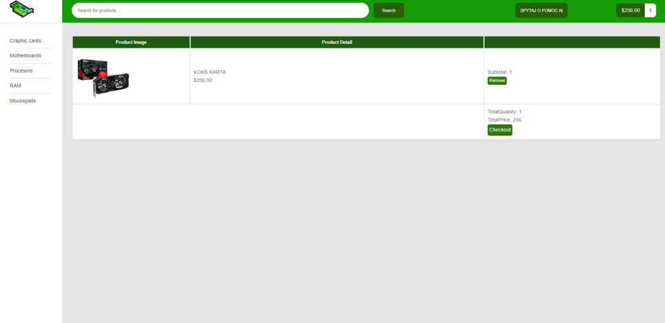
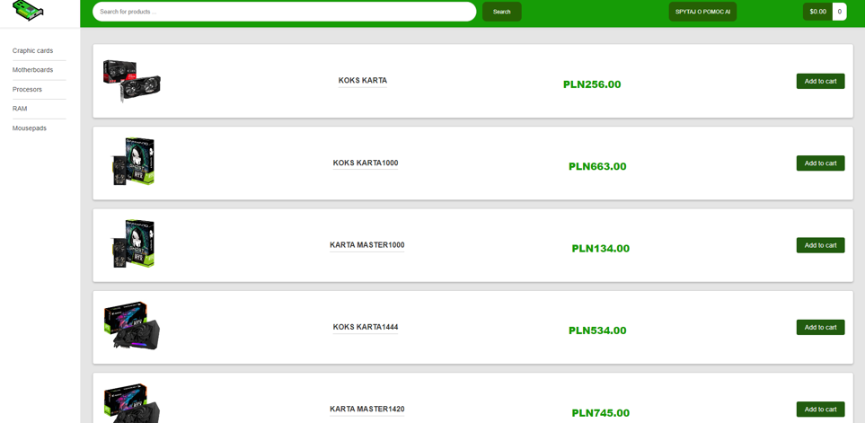
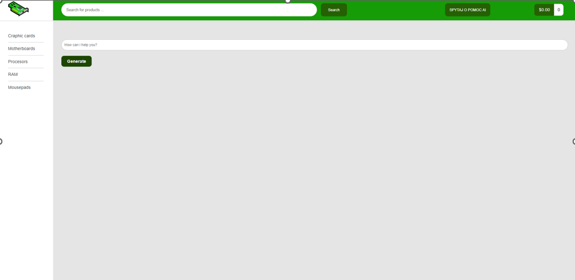
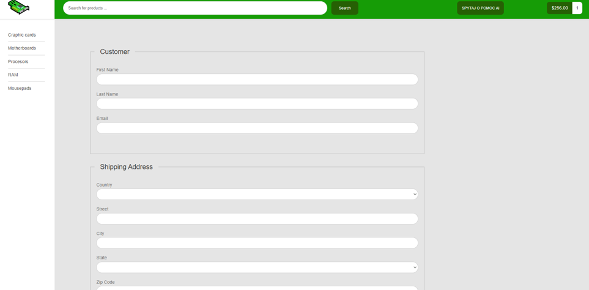
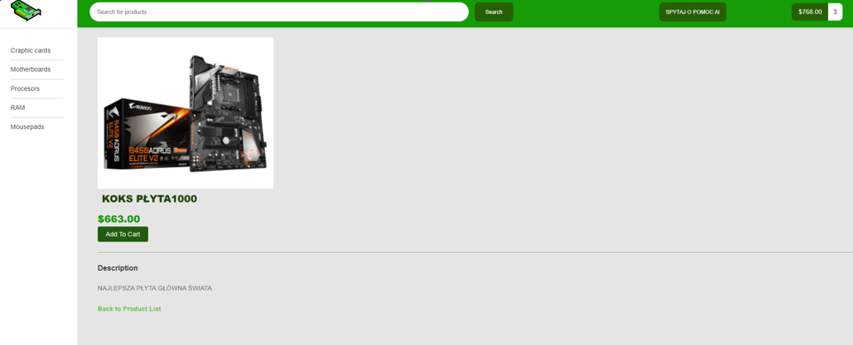

# Dokumentacja Aplikacji ExtraCards
  
## Spis Treści
* [Informacje Ogólne](#informacje-ogólne)
* [Technologie Użyte](#technologie-użyte)
* [Funkcjonalności](#funkcjonalności)
* [Zrzuty Ekranu](#zrzuty-ekranu)
* [Status Projektu](#status-projektu)
* [Plan Rozwoju](#plan-rozwoju)
* [Twórcy](#twórcy)
* [Kontakt](#kontakt)
 
## Informacje Ogólne
- Celem aplikacji jest kupno produktów na stronie internetowej oraz poradzenie się w zakupie produktu chatu ai.
 
## Technologie Użyte
- Java
- Spring
- MySQL
 
## Funkcjonalności
- Dodawanie nowych produktów w sklepie.
- Edycja produktów.
- Kupno produktów.
- Spytanie o pomoc chat AI

 
## Zrzuty Ekranu

**Strona główna**

**Koszyk**

**Produkty**

**Pomoc Chatu**

**Formularz wysyłki**

**Produkt**

 

 
## Jak Korzystać
Dodawaj, edytuj i przeglądaj produktów.
-Wykorzystaj chat AI do pomocy
-Przeglądaj produkty
 
## Status Projektu
Projekt jest w trakcie rozwoju.
 
## Plan Rozwoju
- Wprowadzenie pełnej funkcjonalnościu zakupu produktów.
- Możliwość logowania się.
- możliowść zakupu produktów
 
## Twórca
- Projekt stworzony przez [@Roshuu](https://github.com/Roshuu).
 
## Kontakt
- W przypadku pytań lub sugestii, proszę kontaktować się z twórcami projektu.
